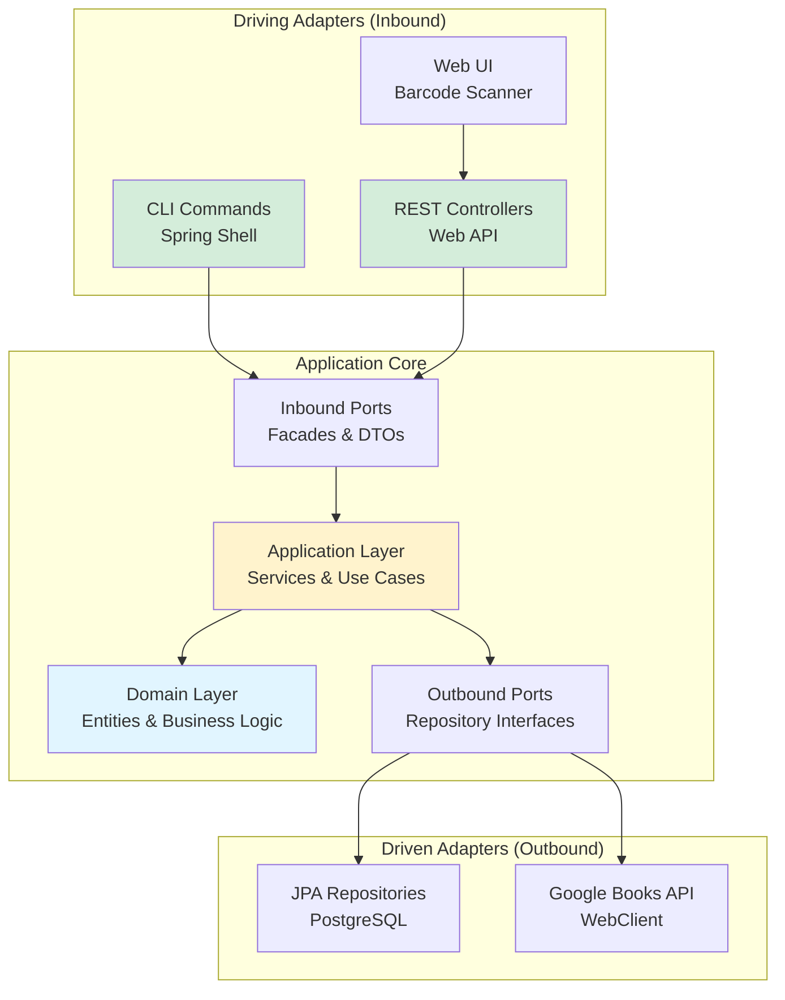
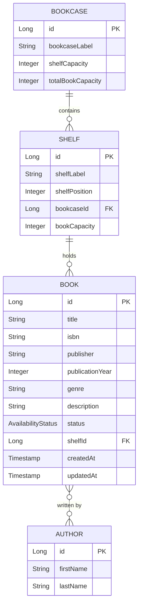

# Bibby

**A Spring Shell-powered personal library management system with barcode scanning, hierarchical storage organization, and clean hexagonal architecture.**

[](https://openjdk.org/)
[](https://spring.io/projects/spring-boot)
[](https://spring.io/projects/spring-shell)
[](https://www.postgresql.org/)
[](https://maven.apache.org/)
[](https://github.com/leodvincci/Bibby/actions)

---

## Table of Contents

- [Overview](#overview)
- [Features](#features)
- [Quickstart](#quickstart)
- [Tech Stack](#tech-stack)
- [Architecture](#architecture)
- [Getting Started](#getting-started)
- [Running the Application](#running-the-application)
- [Testing](#testing)
- [API Documentation](#api-documentation)
- [Configuration](#configuration)
- [Troubleshooting](#troubleshooting)
- [Development](#development)
- [Roadmap](#roadmap)
- [Contributing](#contributing)
- [License](#license)
- [Author](#author)

---

## Overview

**Bibby** is an enterprise-grade personal library management system that combines an interactive command-line interface with a REST API backend. Built to demonstrate clean software engineering practices, Bibby helps you organize physical books using virtual bookcases and shelves while automatically enriching book metadata through the Google Books API.

### What It Does

Bibby solves the problem of tracking physical book collections by providing:

- **ISBN barcode scanning** - Scan barcodes via CLI or web UI to automatically fetch book metadata
- **Hierarchical organization** - Organize books using Bookcase → Shelf → Book structure
- **Availability tracking** - Track book status (AVAILABLE, CHECKED_OUT, RESERVED, LOST, ARCHIVED)
- **Multi-author support** - Handle many-to-many book-author relationships
- **Capacity management** - Enforce shelf capacity constraints
- **Interactive CLI** - Spring Shell-powered commands with multi-step flows
- **REST API** - HTTP endpoints for web and mobile integration

### Who It's For

- **Book collectors** managing personal libraries
- **Home librarians** tracking lending and book locations
- **Java developers** learning clean architecture patterns
- **Students** studying Domain-Driven Design and Hexagonal Architecture

### Key Capabilities

✅ Scan ISBN barcodes (CLI and web) with automatic metadata enrichment
✅ Browse library interactively through bookcases and shelves
✅ Check books in/out with friendly status updates
✅ Search by title, author, or ISBN
✅ Assign books to specific shelf locations
✅ Create and manage hierarchical storage (bookcases with multiple shelves)
✅ RESTful API for external integrations

---

## Features

| Feature | Description | Status |
|---------|-------------|--------|
| **ISBN Barcode Scanning** | CLI and web-based scanning with Google Books API integration | ✅ Complete |
| **Scan-to-Shelf Workflow** | Single flow to scan, add, and place books on shelves | ✅ Complete |
| **Interactive CLI** | Spring Shell commands with multi-step interactive prompts | ✅ Complete |
| **Hierarchical Organization** | Bookcase → Shelf → Book cascading navigation | ✅ Complete |
| **Shelf Capacity Management** | Per-shelf book limits with overflow prevention | ✅ Complete |
| **Multi-Author Support** | Many-to-many book-author relationships | ✅ Complete |
| **Availability Tracking** | AVAILABLE, CHECKED_OUT, RESERVED, LOST, ARCHIVED states | ✅ Complete |
| **REST API** | HTTP endpoints for all core operations | ✅ Complete |
| **Hexagonal Architecture** | Clean ports & adapters with ArchUnit enforcement | ✅ Complete |
| **Google Books Integration** | Automatic metadata enrichment from external API | ✅ Complete |

---

## Quickstart

Get Bibby running in 3 minutes:

```bash
# 1. Clone and navigate
git clone https://github.com/leodvincci/Bibby.git
cd Bibby

# 2. Start PostgreSQL (Docker)
docker run -d \
  --name bibby-postgres \
  -e POSTGRES_DB=amigos \
  -e POSTGRES_USER=amigoscode \
  -e POSTGRES_PASSWORD=password \
  -p 5332:5432 \
  postgres:latest

# 3. Build and run
./mvnw spring-boot:run

# 4. Start using Bibby!
Bibby:_ help
```

**Alternative:** Use the [Dockerfile](#docker-deployment) to run everything in containers.

---

## Tech Stack

### Backend

| Component | Technology | Version | Purpose |
|-----------|-----------|---------|---------|
| **Language** | Java | 17 | Core programming language |
| **Framework** | Spring Boot | 3.5.7 | Application framework, dependency injection |
| **CLI Framework** | Spring Shell | 3.4.1 | Interactive command-line interface |
| **Web** | Spring Web | (via Boot) | REST API controllers |
| **HTTP Client** | Spring WebFlux | (via Boot) | Reactive Google Books API calls |
| **ORM** | Spring Data JPA | (via Boot) | Database persistence layer |
| **Security** | Spring Security | (via Boot) | Web endpoint security |
| **Build Tool** | Maven | 3.8+ | Dependency management, build automation |

### Database

- **PostgreSQL** (production, development)
- **H2** (in-memory for testing)

### Testing

- **JUnit 5** - Unit testing framework
- **Mockito 5.17.0** - Mocking framework
- **ArchUnit 1.3.0** - Architecture rule enforcement
- **Spring Security Test** - Security testing utilities
- **Reactor Test** - Reactive stream testing

### DevOps & CI

- **Docker** - Multi-stage containerization
- **GitHub Actions** - Continuous integration
- **Spotless** - Code formatting (Google Java Format)
- **Maven Surefire/Failsafe** - Test execution

### Frontend Integration

- **ZXing.js** - Web-based barcode scanning (served via separate frontend)
- **SpringDoc OpenAPI 2.8.0** - API documentation and Swagger UI

---

## Architecture

Bibby implements **Hexagonal Architecture** (Ports & Adapters) with **Domain-Driven Design** principles to maintain clean separation of concerns and testability.

### High-Level Component Diagram



### Module Structure

Bibby is organized by **domain modules**, each following hexagonal architecture:

```
library/
├── cataloging/              # Book cataloging domain
│   ├── book/
│   │   ├── contracts/       # Inbound ports, DTOs, facades
│   │   │   ├── ports/
│   │   │   │   ├── inbound/    # BookFacade
│   │   │   │   └── outbound/   # Repository interfaces
│   │   │   └── dtos/           # BookDTO, BookMetaDataResponse
│   │   ├── core/
│   │   │   ├── domain/         # Book, Title, Isbn (value objects)
│   │   │   └── application/    # BookService, IsbnEnrichmentService
│   │   └── infrastructure/
│   │       ├── entity/         # BookEntity (JPA)
│   │       ├── repository/     # JPA implementations
│   │       └── external/       # GoogleBooksClient
│   └── author/
│       ├── contracts/          # AuthorFacade, AuthorDTO
│       ├── core/
│       │   ├── domain/         # Author, AuthorName
│       │   └── application/    # AuthorService
│       └── infrastructure/     # AuthorEntity, AuthorJpaRepository
│
├── stacks/                  # Physical storage domain
│   ├── bookcase/
│   │   ├── contracts/       # BookcaseFacade, BookcaseDTO
│   │   ├── core/
│   │   │   ├── domain/      # Bookcase
│   │   │   └── application/ # BookcaseService
│   │   └── infrastructure/  # BookcaseEntity, repositories
│   └── shelf/
│       ├── contracts/       # ShelfFacade, ShelfDTO
│       ├── core/
│       │   ├── domain/      # Shelf, Capacity (value object)
│       │   └── application/ # ShelfService, BrowseShelfUseCase
│       └── infrastructure/  # ShelfEntity, ShelfJpaRepository
│
├── discovery/               # Book search domain
│   └── core/application/    # SearchBooksUseCase
│
└── registration/            # User registration domain
    ├── contracts/dtos/      # UserRegistrationRequestDTO
    └── core/                # UserRegistrationService
```

### Adapters

**Driving Adapters (Inbound):**
- `cli/command/` - Spring Shell command handlers for interactive CLI
- `web/` - REST controllers exposing HTTP API

**Driven Adapters (Outbound):**
- `infrastructure/repository/` - JPA repository implementations
- `infrastructure/external/` - Google Books API client (WebClient)

### Domain Model



### Core Domain Entities

| Entity | Key Attributes | Relationships |
|--------|---------------|---------------|
| **Book** | id, title, isbn, publisher, status, shelfId | Many-to-Many with Author<br/>Many-to-One with Shelf |
| **Author** | id, firstName, lastName | Many-to-Many with Book |
| **Shelf** | id, shelfLabel, bookCapacity, bookcaseId | One-to-Many with Book<br/>Many-to-One with Bookcase |
| **Bookcase** | id, bookcaseLabel, shelfCapacity | One-to-Many with Shelf |

### Availability Status Enum

Books track their circulation state:

- **AVAILABLE** - On shelf, ready to check out
- **CHECKED_OUT** - Currently borrowed
- **RESERVED** - Reserved for future pickup
- **LOST** - Marked as missing
- **ARCHIVED** - Removed from active circulation

### Design Patterns

- **Hexagonal Architecture** - Ports & adapters for testability
- **Domain-Driven Design** - Rich domain models with business logic
- **Repository Pattern** - Data persistence abstraction
- **Factory Pattern** - Centralized object creation
- **DTO Pattern** - Data transfer across boundaries
- **Facade Pattern** - Simplified module interfaces
- **Value Objects** - Immutable domain primitives (BookId, Title, Isbn)

---

## Getting Started

### Prerequisites

- **Java 17+** (OpenJDK or Oracle JDK)
- **PostgreSQL** (or Docker to run PostgreSQL)
- **Maven 3.8+** (or use included Maven Wrapper)

### Installation

1. **Clone the repository:**

```bash
git clone https://github.com/leodvincci/Bibby.git
cd Bibby
```

2. **Start PostgreSQL:**

**Option A: Docker (Recommended)**
```bash
docker run -d \
  --name bibby-postgres \
  -e POSTGRES_DB=amigos \
  -e POSTGRES_USER=amigoscode \
  -e POSTGRES_PASSWORD=password \
  -p 5332:5432 \
  postgres:latest
```

**Option B: Native PostgreSQL**
```bash
# Start PostgreSQL service
sudo systemctl start postgresql

# Create database
psql -U postgres
CREATE DATABASE amigos;
\q
```

3. **Configure database connection (optional):**

If your PostgreSQL runs on different credentials, edit `src/main/resources/application.properties`:

```properties
spring.datasource.url=jdbc:postgresql://localhost:5332/amigos
spring.datasource.username=amigoscode
spring.datasource.password=password
```

4. **Build the project:**

```bash
./mvnw clean install
```

### Environment Variables

Bibby uses `application.properties` for configuration. No separate `.env` file is required, but you can override properties via environment variables:

| Property | Environment Variable | Default | Description |
|----------|---------------------|---------|-------------|
| `spring.datasource.url` | `SPRING_DATASOURCE_URL` | `jdbc:postgresql://localhost:5332/amigos` | PostgreSQL connection URL |
| `spring.datasource.username` | `SPRING_DATASOURCE_USERNAME` | `amigoscode` | Database username |
| `spring.datasource.password` | `SPRING_DATASOURCE_PASSWORD` | `password` | Database password |
| `spring.jpa.hibernate.ddl-auto` | `SPRING_JPA_HIBERNATE_DDL_AUTO` | `create-drop` | Schema management strategy |

**Example:**
```bash
export SPRING_DATASOURCE_URL=jdbc:postgresql://localhost:5432/mybibby
export SPRING_DATASOURCE_USERNAME=myuser
export SPRING_DATASOURCE_PASSWORD=mypass
./mvnw spring-boot:run
```

---

## Running the Application

### Run Backend (CLI Mode)

**Using Maven Wrapper (Recommended):**
```bash
./mvnw spring-boot:run
```

**Using Installed Maven:**
```bash
mvn spring-boot:run
```

**Using JAR (after build):**
```bash
java -jar target/Bibby-0.0.1-SNAPSHOT.jar
```

### First Launch

On startup, you'll see the Bibby ASCII banner and drop into an interactive shell:

```
██████╗ ██╗██████╗ ██████╗ ██╗   ██╗
██╔══██╗██║██╔══██╗██╔══██╗╚██╗ ██╔╝
██████╔╝██║██████╔╝██████╔╝ ╚████╔╝
██╔══██╗██║██╔══██╗██╔══██╗  ╚██╔╝
██████╔╝██║██████╔╝██████╔╝   ██║
╚═════╝ ╚═╝╚═════╝ ╚═════╝    ╚═╝

Bibby:_
```

Type `help` to see all available commands.

### Run Frontend (Optional)

The web barcode scanner UI is in a separate repository:
```bash
# Clone frontend (if available)
git clone https://github.com/leodvincci/Bibby-Web.git
cd Bibby-Web
# Follow frontend setup instructions
```

Access web interface at: `http://localhost:5173` (or configured port)

### Docker Deployment

**Build Docker image:**
```bash
docker build -t bibby:latest .
```

**Run with Docker:**
```bash
# Run PostgreSQL
docker run -d \
  --name bibby-postgres \
  -e POSTGRES_DB=amigos \
  -e POSTGRES_USER=amigoscode \
  -e POSTGRES_PASSWORD=password \
  -p 5332:5432 \
  postgres:latest

# Run Bibby (update DB URL to Docker network)
docker run -it \
  --name bibby-app \
  -e SPRING_DATASOURCE_URL=jdbc:postgresql://host.docker.internal:5332/amigos \
  -p 8080:8080 \
  bibby:latest
```

**Note:** For production, use Docker Compose (not currently included in repo).

---

## Testing

### Run All Tests

```bash
./mvnw test
```

### Run Specific Test

```bash
./mvnw test -Dtest=BookServiceTest
```

### Run Tests with Coverage

```bash
./mvnw test jacoco:report
# View report: target/site/jacoco/index.html
```

### Run Full Verification (Tests + Code Quality)

```bash
./mvnw clean verify
```

### Test Structure

Tests are organized by domain module:

```
src/test/java/com/penrose/bibby/
├── BibbyApplicationTests.java          # Context load test
├── cli/
│   ├── BookCommandLineTest.java        # ArchUnit architecture tests
│   ├── command/book/
│   │   ├── BookCreateIsbnCommandsTest
│   │   └── BookManagementCommandsTest
│   └── ui/BookcardRendererTest
├── library/
│   ├── author/core/domain/
│   │   ├── AuthorNameTest
│   │   └── AuthorRepositoryTest
│   ├── book/
│   │   ├── BookServiceTest
│   │   └── infrastructure/repository/
│   │       └── BookDomainRepositoryImplTest
│   ├── classification/core/domain/
│   │   └── BooklistTest
│   └── stacks/shelf/core/application/
│       └── BrowseShelfUseCaseTest
└── web/registration/
    └── UserRegistrationControllerTest
```

### Testing Strategy

- **Unit Tests** - Domain logic, value objects, services
- **Integration Tests** - Repository layer with H2 in-memory DB
- **Architecture Tests** - ArchUnit rules enforcing hexagonal boundaries
- **Controller Tests** - REST API endpoints with MockMvc

**Current Coverage:** Tests cover core domain entities, services, and repositories. CLI command tests and end-to-end integration tests are planned.

---

## API Documentation

Bibby exposes a REST API for web and mobile integration.

**Base URL:** `http://localhost:8080`

**Swagger UI:** `http://localhost:8080/swagger-ui.html` (SpringDoc OpenAPI)

### Book Endpoints

#### Add Book Manually
```http
POST /api/v1/books
Content-Type: application/json

{
  "title": "Clean Architecture",
  "isbn": "9780134494166",
  "publisher": "Prentice Hall",
  "authors": [
    {"firstName": "Robert", "lastName": "Martin"}
  ]
}
```

**Response:** `200 OK`
```json
"Book Added Successfully: Clean Architecture"
```

#### Search Book by Title
```http
GET /api/v1/books
Content-Type: application/json

{
  "title": "Clean Architecture"
}
```

#### Search Book by ISBN
```http
GET /api/v1/books/search/{isbn}
```

**Example:**
```bash
curl http://localhost:8080/api/v1/books/search/9780134494166
```

**Response:** `200 OK`
```json
{
  "bookId": 1,
  "title": "Clean Architecture",
  "isbn": "9780134494166",
  "authors": ["Robert Martin"],
  "publisher": "Prentice Hall",
  "description": "..."
}
```

#### Assign Book to Shelf
```http
POST /api/v1/books/{bookId}/shelf
Content-Type: application/json

{
  "shelfId": 5
}
```

**Response:** `200 OK`
```json
{
  "bookId": 1,
  "bookTitle": "Clean Architecture",
  "shelfId": 5,
  "shelfLabel": "Shelf A-1",
  "bookcaseLabel": "Main Library"
}
```

### Book Import Endpoints

#### Import Book by ISBN (with Google Books enrichment)
```http
POST /import/books
Content-Type: application/json

{
  "isbn": "9781449373320"
}
```

**Response:** `200 OK`
```json
{
  "bookId": 2,
  "title": "Designing Data-Intensive Applications",
  "isbn": "9781449373320",
  "authors": ["Martin Kleppmann"],
  "publisher": "O'Reilly Media",
  "description": "Data is at the center of many challenges..."
}
```

### Shelf Endpoints

#### Get All Shelf Options
```http
GET /api/v1/shelves/options
```

**Response:** `200 OK`
```json
[
  {
    "shelfId": 1,
    "shelfLabel": "Shelf A-1",
    "bookcaseLabel": "Main Library",
    "currentCapacity": 5,
    "maxCapacity": 10
  }
]
```

### Bookcase Endpoints

#### Create Bookcase
```http
POST /create/bookcase
Content-Type: application/json

{
  "bookcaseLabel": "Main Library",
  "shelfCapacity": 5,
  "bookCapacity": 10
}
```

**Response:** `201 CREATED`

### User Registration Endpoints

#### Register New User
```http
POST /api/v1/user/registration/register
Content-Type: application/json

{
  "email": "user@example.com",
  "password": "SecurePassword123"
}
```

**Response:** `201 CREATED`
```json
{
  "email": "user@example.com"
}
```

### External Integration

#### Lookup Book Metadata (Google Books)
```http
GET /lookup/{isbn}
```

**Example:**
```bash
curl http://localhost:8080/lookup/9780134494166
```

**Response:** `200 OK` (GoogleBooksResponse object with full metadata)

---

## Configuration

### Application Profiles

Bibby supports multiple Spring profiles:

| Profile | File | Purpose |
|---------|------|---------|
| **default** | `application.properties` | Development (active by default) |
| **dev** | `application-dev.properties` | Development overrides |
| **staging** | `application-staging.properties` | Staging environment |
| **prod** | `application-prod.properties` | Production environment |

**Activate profile:**
```bash
./mvnw spring-boot:run -Dspring-boot.run.profiles=prod
```

### Key Configuration Settings

#### Database (application.properties)

```properties
# PostgreSQL connection
spring.datasource.url=jdbc:postgresql://localhost:5332/amigos
spring.datasource.username=amigoscode
spring.datasource.password=password

# Schema management (WARNING: create-drop deletes data on restart!)
spring.jpa.hibernate.ddl-auto=create-drop
```

⚠️ **IMPORTANT:** `create-drop` means **all data is lost on restart**. This is intentional for development. Change to `update` or `validate` for production.

#### Logging

```properties
# Logging disabled by default for clean CLI experience
logging.level.org.springframework=OFF
logging.level.org.hibernate=OFF
logging.level.root=OFF

# Enable for debugging:
# logging.level.root=INFO
# logging.level.org.springframework=INFO
```

#### CLI & Display

```properties
# Enable interactive shell
spring.shell.interactive.enabled=true

# Enable ANSI colors in terminal
spring.output.ansi.enabled=ALWAYS

# Custom ASCII banner
spring.main.banner-mode=console
```

#### Error Handling

```properties
# API error responses
server.error.include-message=always
server.error.include-binding-errors=never
server.error.include-stacktrace=never
```

### Code Formatting

Bibby uses **Spotless** with **Google Java Format**:

```bash
# Check formatting
./mvnw spotless:check

# Apply formatting
./mvnw spotless:apply
```

Spotless runs automatically in CI/CD pipeline.

---

## Troubleshooting

### Database Connection Issues

**Problem:** `Connection refused` or `could not connect to server`

**Solutions:**
1. Verify PostgreSQL is running:
   ```bash
   docker ps | grep postgres
   # or
   sudo systemctl status postgresql
   ```

2. Check port 5332 is correct:
   ```bash
   psql -U amigoscode -h localhost -p 5332 -d amigos
   ```

3. Verify database exists:
   ```sql
   psql -U postgres
   \l  -- list all databases
   ```

4. Update credentials in `application.properties` if different

### Port Already in Use

**Problem:** `Port 8080 is already in use`

**Solutions:**
```bash
# Find process on port 8080
lsof -ti:8080

# Kill the process
lsof -ti:8080 | xargs kill -9

# Or run on different port
./mvnw spring-boot:run -Dserver.port=8081
```

### Maven Build Fails

**Problem:** Compilation errors or dependency issues

**Solutions:**
```bash
# Clean and rebuild with fresh dependencies
./mvnw clean install -U

# Skip tests if they're failing
./mvnw clean install -DskipTests

# Ensure Java 17+ is active
java -version
```

### Tests Fail with Mockito Errors

**Problem:** `MockitoException` or agent initialization errors

**Solutions:**
1. Ensure Java 17 is being used (not Java 8/11)
2. Check Maven Surefire plugin configuration in `pom.xml`
3. Clear Maven cache:
   ```bash
   rm -rf ~/.m2/repository/org/mockito
   ./mvnw clean test
   ```

### Data Not Persisting

**Problem:** All data disappears on restart

**Explanation:** This is **expected behavior** with `create-drop` setting.

**Solutions:**
- For development: This is intentional for clean state
- For production: Change in `application.properties`:
  ```properties
  spring.jpa.hibernate.ddl-auto=update
  ```

### CLI Colors Not Working

**Problem:** ANSI escape codes appear as text

**Solutions:**
1. Ensure terminal supports ANSI colors
2. Verify setting in `application.properties`:
   ```properties
   spring.output.ansi.enabled=ALWAYS
   ```
3. Try running in different terminal (e.g., Windows Terminal, iTerm2)

### Google Books API Rate Limiting

**Problem:** `429 Too Many Requests` from Google Books API

**Solutions:**
1. Wait a few minutes for rate limit reset
2. Consider implementing caching for repeated lookups
3. Use manual book entry as fallback:
   ```
   Bibby:_ book new
   ```

---

## Development

### Project Philosophy

Bibby is built as a **long-term learning platform** for practicing:

- **Hexagonal Architecture** - Clean separation of concerns
- **Domain-Driven Design** - Rich domain models with business logic
- **Test-Driven Development** - Comprehensive test coverage
- **Clean Code Principles** - Readable, maintainable code
- **Systematic Refactoring** - Incremental architectural improvements

### Development Workflow

```
command → flow → service → domain → repository → persistence
```

1. Implement feature in one domain module as template
2. Validate approach through testing and code review
3. Apply learned patterns systematically to other modules
4. Maintain clean git history with descriptive commits
5. Document architectural decisions in `docs/`

### Development Principles

1. **Hexagonal Architecture** - Clear boundaries between domain and infrastructure
2. **Domain-Driven Design** - Business rules live in domain models
3. **Start simple, refactor when justified** - Avoid premature optimization
4. **Test early, test often** - Catch issues before they compound
5. **Document decisions** - Maintain records in `docs/the-devlogs/`
6. **Package by feature** - Keep related components together

### Running in Development Mode

```bash
# Run with dev profile
./mvnw spring-boot:run -Dspring-boot.run.profiles=dev

# Enable debug logging
./mvnw spring-boot:run -Dlogging.level.root=DEBUG

# Run with hot reload (spring-boot-devtools)
./mvnw spring-boot:run
# Edit files and they'll auto-reload
```

### Code Quality Checks

```bash
# Run Spotless formatting check
./mvnw spotless:check

# Auto-format code
./mvnw spotless:apply

# Run all checks (tests + formatting)
./mvnw clean verify
```

### Adding New Commands

Example of adding a new Spring Shell command:

```java
@ShellComponent
public class MyCommands {

    @ShellMethod(value = "My command description", key = "my-command")
    public String myCommand(String param) {
        // Command logic
        return "Result";
    }
}
```

### Documentation

Comprehensive development docs in `docs/`:

- **`docs/the-devlogs/`** - Development session logs with learnings
- **`docs/systems/`** - System design documents
- **`docs/engineering/`** - Technical specs, architecture decisions
- **`docs/sprints/`** - Sprint planning and retrospectives

**Blog:** [Building Bibby](https://buildingbibby.hashnode.dev/)

---

## Roadmap

### ✅ Completed (v0.0.1-SNAPSHOT)

- ✅ Hexagonal architecture across all domain modules
- ✅ ISBN barcode scanning with Google Books API
- ✅ Scan-to-shelf complete workflow
- ✅ Multi-author many-to-many relationships
- ✅ Shelf capacity management and enforcement
- ✅ Entity/domain separation with factory patterns
- ✅ REST API with SpringDoc OpenAPI
- ✅ Web-based barcode scanner UI integration
- ✅ Interactive browse flow (Bookcase → Shelf → Book)
- ✅ Check-in/check-out with availability tracking
- ✅ CI/CD pipeline with GitHub Actions
- ✅ Code formatting with Spotless

### 🔄 In Progress

- 🔄 ArchUnit tests to enforce architectural boundaries
- 🔄 Expanding unit test coverage across modules
- 🔄 Consolidating mapper classes
- 🔄 Implementing facade contracts for cross-domain communication

### 🎯 Planned Features

**Architecture & Testing**
- ⬜ Comprehensive ArchUnit test suite
- ⬜ Integration tests for CLI flows
- ⬜ End-to-end test scenarios
- ⬜ Performance testing and optimization

**Features**
- ⬜ Pagination for large result sets
- ⬜ Advanced search filters (genre, year, publisher)
- ⬜ Book recommendations based on reading history
- ⬜ Statistics dashboard (CLI + web)
- ⬜ Export/import functionality (CSV, JSON)
- ⬜ Reading lists and collections
- ⬜ Book notes and ratings

**User Experience**
- ⬜ Enhanced CLI selector UX (fuzzy search, colors)
- ⬜ Command history and autocomplete
- ⬜ Batch operations (import multiple books)
- ⬜ Undo/redo for recent actions

**Infrastructure**
- ⬜ Docker Compose setup for one-command deployment
- ⬜ Persistent data storage option (toggle `create-drop` → `update`)
- ⬜ Database migration scripts (Flyway/Liquibase)
- ⬜ Multi-library support (multi-tenant)
- ⬜ User authentication and authorization
- ⬜ API rate limiting and caching

**DevOps**
- ⬜ Production-ready Docker images
- ⬜ Kubernetes deployment manifests
- ⬜ Monitoring and observability (Prometheus, Grafana)
- ⬜ API versioning strategy

### Known Limitations

⚠️ **No data persistence** - `create-drop` setting wipes data on restart
⚠️ **Single user only** - No authentication or multi-user support
⚠️ **Google Books API quota** - External API may rate-limit requests
⚠️ **No pagination** - Large collections may impact performance
⚠️ **Manual PostgreSQL setup** - No Docker Compose yet
⚠️ **Incomplete test coverage** - Some modules need more tests
⚠️ **CLI only for primary UX** - Web UI is minimal (barcode scanner only)

---

## Contributing

This is a **personal learning project** and is not currently accepting external contributions.

However, feedback and suggestions are welcome:

- **Issues:** Report bugs or suggest features via [GitHub Issues](https://github.com/leodvincci/Bibby/issues)
- **Discussions:** Architecture discussions and questions are encouraged
- **Fork:** Feel free to fork and experiment with your own variations

If you find this project helpful for learning, please consider:
- ⭐ **Star** the repository
- 📝 **Share** your learnings or blog about it
- 🔗 **Link** to it in your portfolio

---

## License

This project is a **personal learning endeavor** and is currently **not licensed for external use**.

If you'd like to use this code for educational purposes or derivative works, please reach out for permission.

**Copyright © 2024-2026 Leo D. Penrose. All rights reserved.**

---

## Author

**Leo D. Penrose**
*Software Engineer • Systems Thinker • Lifelong Learner*

Building Bibby to master clean architecture, domain-driven design, and enterprise Java patterns through hands-on practice.

- **GitHub:** [@leodvincci](https://github.com/leodvincci)
- **Blog:** [Building Bibby](https://buildingbibby.hashnode.dev/)
- **LinkedIn:** [Leo D. Penrose](https://linkedin.com/in/leodpenrose)

---

## Acknowledgments

- **Spring Framework Team** - For the powerful ecosystem and excellent documentation
- **Spring Shell Team** - For making CLI development elegant and expressive
- **Google Books API** - For free book metadata enrichment
- **ZXing Project** - For open-source barcode scanning
- **Amigoscode** - For inspiring clean architecture practices
- **Domain-Driven Design Community** - For patterns and principles
- **Alistair Cockburn** - For Hexagonal Architecture

---

## Additional Resources

### Learning Resources

- [Spring Shell Documentation](https://docs.spring.io/spring-shell/docs/current/reference/htmlsingle/)
- [Hexagonal Architecture Guide](https://alistair.cockburn.us/hexagonal-architecture/)
- [Domain-Driven Design Reference](https://www.domainlanguage.com/ddd/reference/)
- [Google Books API Documentation](https://developers.google.com/books/docs/v1/using)
- [Spring Boot Best Practices](https://spring.io/guides)

### Related Projects

- **Frontend Repository:** [Bibby-Web](https://github.com/leodvincci/Bibby-Web) (separate React/Vue frontend)
- **Blog Series:** [Building Bibby](https://buildingbibby.hashnode.dev/)

### Documentation

- **Development Logs:** `docs/the-devlogs/`
- **System Architecture:** `docs/systems/`
- **Engineering Decisions:** `docs/engineering/`

---

<div align="center">

**Bibby** - *Your Library. Your Rules.*

[](https://github.com/leodvincci/Bibby)
[](https://github.com/leodvincci/Bibby/fork)

Made with ☕ and 💙 by [Leo D. Penrose](https://github.com/leodvincci)

</div>
