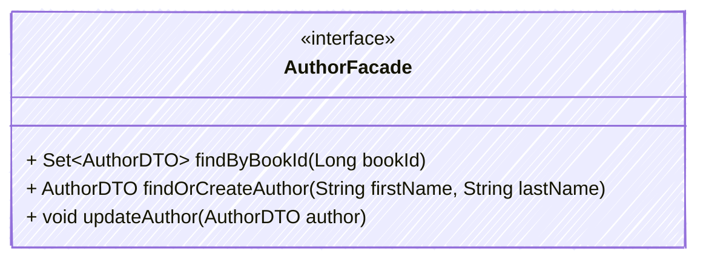

```mermaid
---
config:
  look: handDrawn
  theme: mc
---
classDiagram

    direction BT

%% Facade as inbound adapter
    class AuthorFacade {
<<interface>>   
        + Set~AuthorDTO~      findByBookId(Long bookId)
        + AuthorDTO           findOrCreateAuthor(String firstName, String lastName)
        + void                updateAuthor(AuthorDTO author)
    }

```