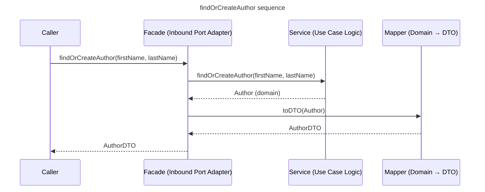

```mermaid
sequenceDiagram
    title findOrCreateAuthor sequence

    participant Caller
    participant AuthorFacadeImpl as Facade (Inbound Port Adapter)
    participant AuthorService as Service (Use Case Logic)
    participant AuthorMapper as Mapper (Domain → DTO)

%% Caller invokes the inbound port
    Caller->>AuthorFacadeImpl: findOrCreateAuthor(firstName, lastName)

%% Facade delegates to Application layer
    AuthorFacadeImpl->>AuthorService: findOrCreateAuthor(firstName, lastName)
    AuthorService-->>AuthorFacadeImpl: Author (domain)

%% Facade maps domain → DTO for the outside world
    AuthorFacadeImpl->>AuthorMapper: toDTO(Author)
    AuthorMapper-->>AuthorFacadeImpl: AuthorDTO

%% Return DTO to external caller
    AuthorFacadeImpl-->>Caller: AuthorDTO


```