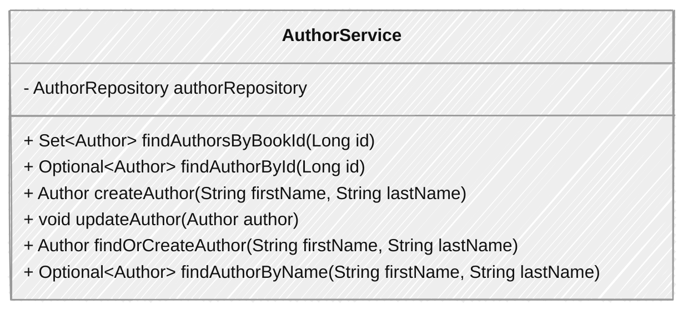

```mermaid
---
config:
  look: handDrawn
  theme: neutral
  class:
    hideEmptyMembersBox: false
---

classDiagram
    direction TB

    class AuthorService {
        - AuthorRepository authorRepository
        + Set~Author~ findAuthorsByBookId(Long id)
        + Optional~Author~ findAuthorById(Long id)
        + Author createAuthor(String firstName, String lastName)
        + void updateAuthor(Author author)
        + Author findOrCreateAuthor(String firstName, String lastName)
        + Optional~Author~ findAuthorByName(String firstName, String lastName)
    }


```