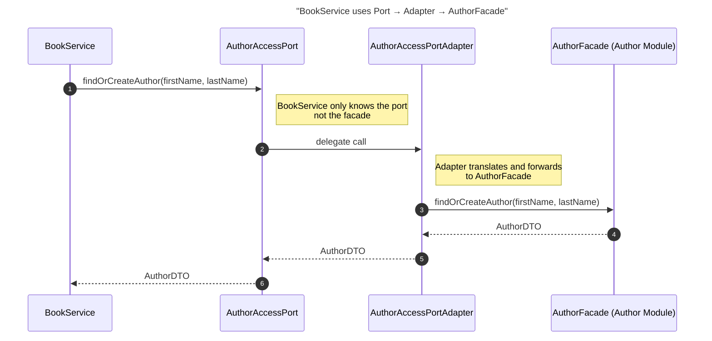

```mermaid
---
config:
  look: handDrawn
---
sequenceDiagram
    autonumber
    title "BookService uses Port → Adapter → AuthorFacade"

    participant BS as BookService
    participant PORT as AuthorAccessPort
    participant AD as AuthorAccessPortAdapter
    participant AF as AuthorFacade (Author Module)

    BS->>PORT: findOrCreateAuthor(firstName, lastName)
    note right of PORT: BookService only knows the port<br>not the facade

    PORT->>AD: delegate call
    note right of AD: Adapter translates and forwards<br>to AuthorFacade

    AD->>AF: findOrCreateAuthor(firstName, lastName)
    AF-->>AD: AuthorDTO
    AD-->>PORT: AuthorDTO
    PORT-->>BS: AuthorDTO

```