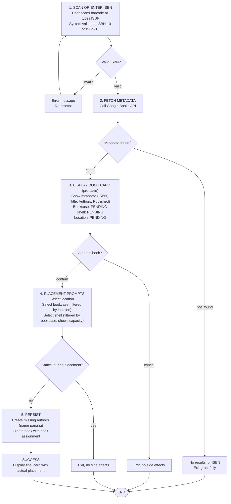

```mermaid

flowchart TD
  A["1. SCAN OR ENTER ISBN<br/>User scans barcode or types ISBN<br/>System validates ISBN-10 or ISBN-13"] --> B{Valid ISBN?}

  B -- invalid --> B1["Error message<br/>Re-prompt"] --> A
  B -- valid --> C["2. FETCH METADATA<br/>Call Google Books API"] --> D{Metadata found?}

  D -- not_found --> D1["No results for ISBN<br/>Exit gracefully"] --> Z([END])
  D -- found --> E["3. DISPLAY BOOK CARD (pre-save)<br/>Show metadata (ISBN, Title, Authors, Published)<br/>Bookcase: PENDING<br/>Shelf: PENDING<br/>Location: PENDING"] --> F{Add this book?}

  F -- cancel --> F1["Exit, no side effects"] --> Z
  F -- confirm --> G["4. PLACEMENT PROMPTS<br/>Select location<br/>Select bookcase (filtered by location)<br/>Select shelf (filtered by bookcase, shows capacity)"] --> H{Cancel during placement?}

  H -- yes --> H1["Exit, no side effects"] --> Z
  H -- no --> I["5. PERSIST<br/>Create missing authors (name parsing)<br/>Create book with shelf assignment"] --> J["SUCCESS<br/>Display final card with actual placement"] --> Z


```