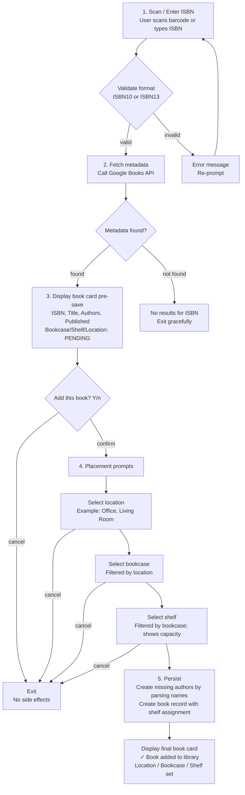

```mermaid
flowchart TD
  A["1. Scan / Enter ISBN<br>User scans barcode or types ISBN"] --> B{"Validate format<br>ISBN10 or ISBN13"}

  B -- valid --> C["2. Fetch metadata<br>Call Google Books API"]
  B -- invalid --> B1["Error message<br>Re-prompt"] --> A

  C --> D{"Metadata found?"}
  D -- found --> E["3. Display book card pre-save<br>ISBN, Title, Authors, Published<br>Bookcase/Shelf/Location: PENDING"]
  D -- not found --> D1["No results for ISBN<br>Exit gracefully"]

  E --> F{"Add this book? Y/n"}
  F -- cancel --> K["Exit<br>No side effects"]
  F -- confirm --> G["4. Placement prompts"]

  G --> H["Select location<br>Example: Office, Living Room"]
  H --> I["Select bookcase<br>Filtered by location"]
  I --> J["Select shelf<br>Filtered by bookcase; shows capacity"]

  H -- cancel --> K
  I -- cancel --> K
  J -- cancel --> K

  J --> L["5. Persist<br>Create missing authors by parsing names<br>Create book record with shelf assignment"]
  L --> M["Display final book card<br>✓ Book added to library<br>Location / Bookcase / Shelf set"]

```